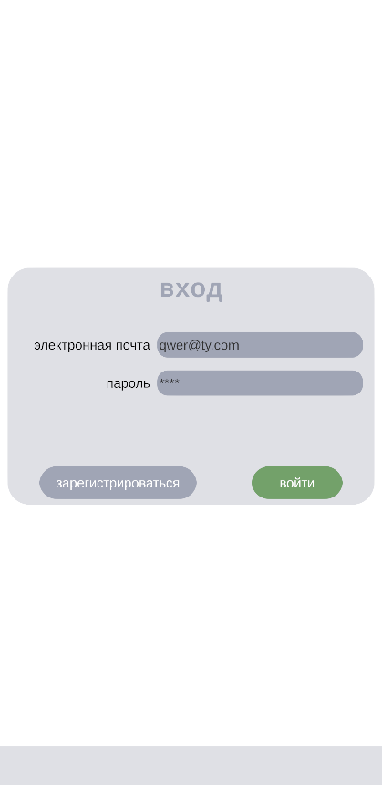
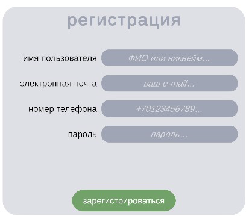
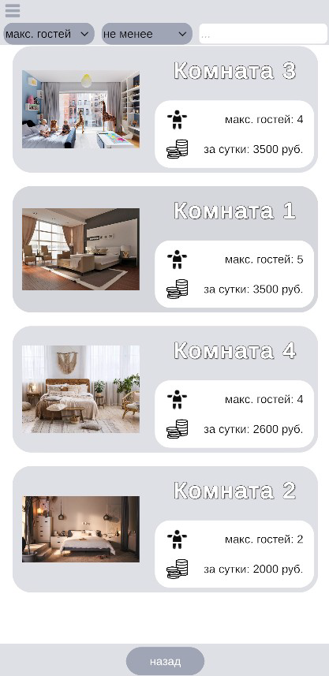
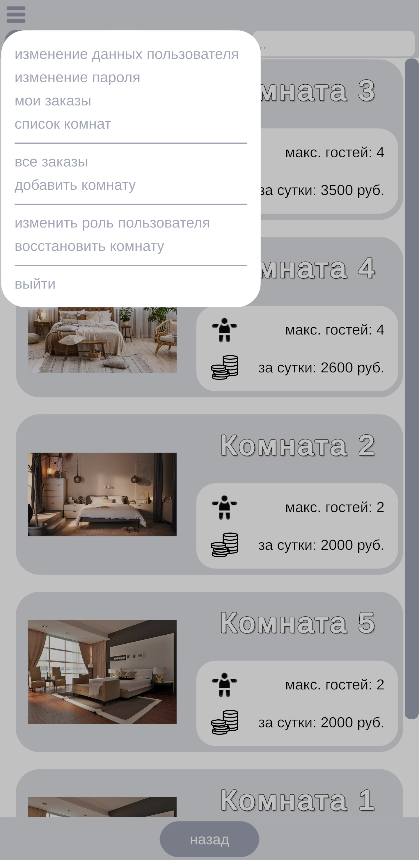
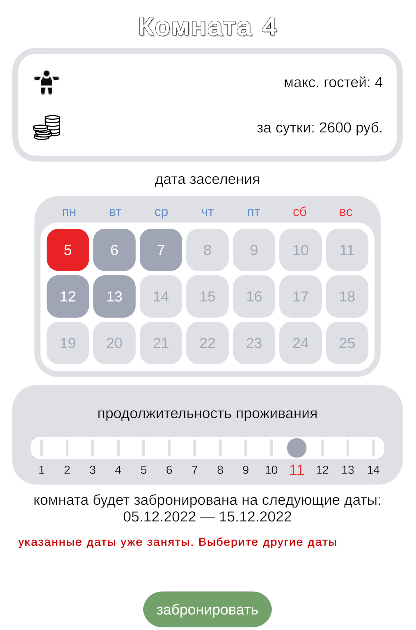
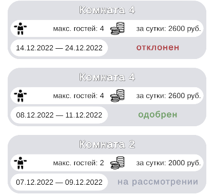
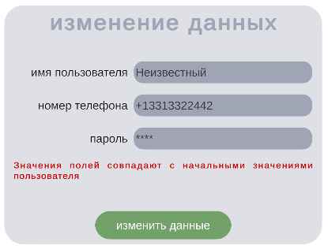
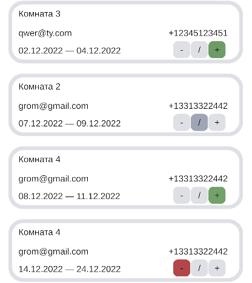
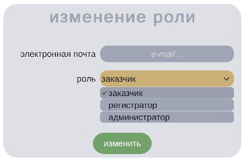

# unity-hotel-mobile-app
Mobile application for booking rooms in hotel.

This app provides 3 roles for users: customer, receptionist, admin.

Customers can:
- register
- log in
- view rooms list
- view information about the selected room
- book a room
- manage their orders
- edit their personal data (username, phone number, password)

Receptionists in addition to the above can:
- view orders of all users and manage them
- add, edit or remove rooms

Admins in addition to the above can:
- change role of the selected user
- restore removed rooms

For password hashing I used the PBKDF2 algorithm.
For encrypting user phone numbers I used the AES block cipher algorithm.

Some screenshots:
Logging in

Registration

Rooms list

Menu

Room info

Room booking

Customer's orders

Editing of user's personal data

List of all orders

Changing of user's role

